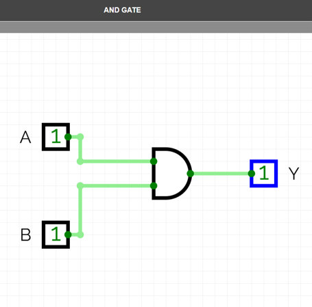
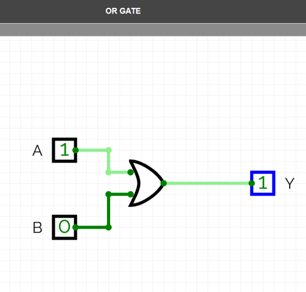
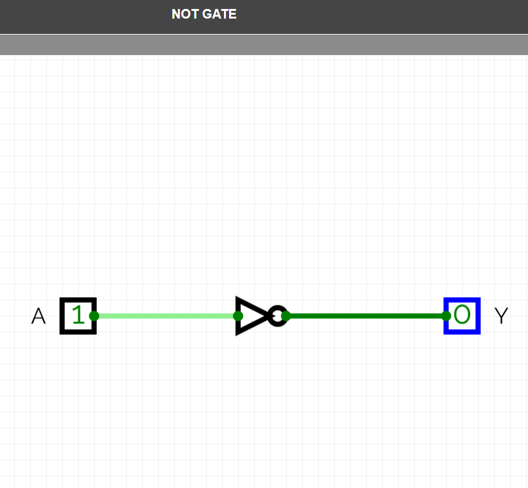
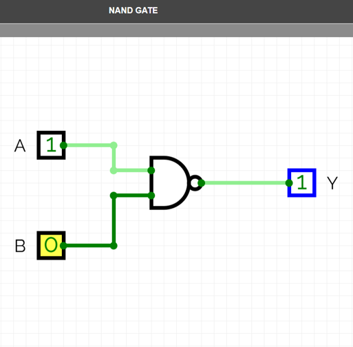
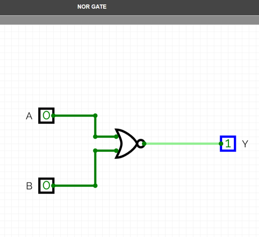
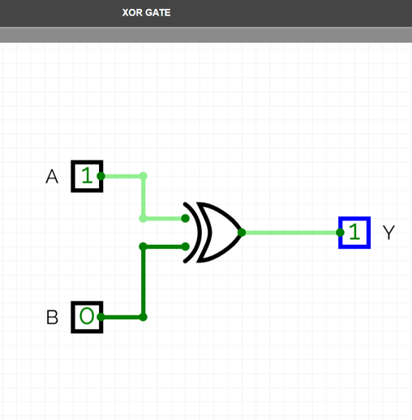
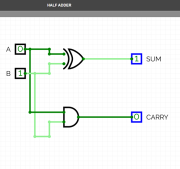
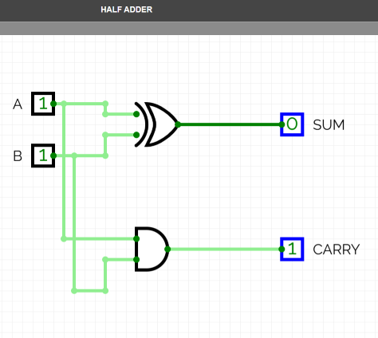
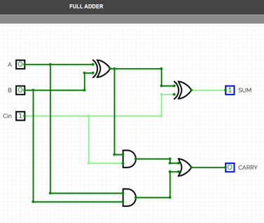
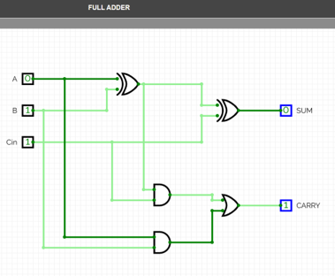

# Task - 1 Digital Logic Circuit Design using CircuitVerse

## Highlights

✔ Basic Logic Gates Implementation

✔ Half Adder Design and Verification

✔ Full Adder Design and Verification

✔ Truth Table Validation

✔ CircuitVerse Simulation

## Overview

Digital logic circuits are the fundamental building blocks of modern digital systems, computers, microprocessors, and VLSI circuits. This project focuses on the design and simulation of basic combinational logic circuits using the CircuitVerse simulator.

The implemented circuits include basic logic gates, Half Adder, and Full Adder. Each circuit was verified using different input combinations and compared with its corresponding truth table to ensure correct functionality.

This repository contains the implementation and simulation of fundamental digital logic gates and basic combinational circuits as part of the VLSI Design Internship at Maincrafts Technology.

---

## Documentation

[Digital Logic Circuit Report](report/Digital_Logic_Circuit_Report.pdf)

---

## Objectives

- Understand the working of basic digital logic gates.
- Design and simulate combinational logic circuits.
- Verify circuit outputs using truth tables.
- Implement Half Adder and Full Adder circuits.
- Gain practical experience using CircuitVerse Simulator.
- Build a foundation for advanced digital and VLSI design.

---

## Tools Used

- CircuitVerse Simulator
  
---

## Implemented Circuits

### Basic Logic Gates

- AND Gate
- OR Gate
- NOT Gate
- NAND Gate
- NOR Gate
- XOR Gate

### Combinational Circuits

- Half Adder
- Full Adder

---

# AND Gate

The AND gate performs logical multiplication. The output becomes HIGH only when both inputs are HIGH.

### Boolean Expression

`Y = A · B`

### Truth Table

| A | B | Y |
|---|---|---|
| 0 | 0 | 0 |
| 0 | 1 | 0 |
| 1 | 0 | 0 |
| 1 | 1 | 1 |

### Circuit Simulation

---

# OR Gate

The OR gate performs logical addition. The output becomes HIGH when at least one input is HIGH.

### Boolean Expression

`Y = A + B`

### Truth Table

| A | B | Y |
|---|---|---|
| 0 | 0 | 0 |
| 0 | 1 | 1 |
| 1 | 0 | 1 |
| 1 | 1 | 1 |

### Circuit Simulation

---

# NOT Gate

The NOT gate is an inverter. It produces the complement of the input signal.

### Boolean Expression

`Y = A'`

### Truth Table

| A | Y |
|---|---|
| 0 | 1 |
| 1 | 0 |

### Circuit Simulation

---

# NAND Gate

The NAND gate is the complement of the AND gate. It outputs LOW only when all inputs are HIGH.

### Boolean Expression

`Y = (A · B)'`  

### Truth Table

| A | B | Y |
|---|---|---|
| 0 | 0 | 1 |
| 0 | 1 | 1 |
| 1 | 0 | 1 |
| 1 | 1 | 0 |

### Circuit Simulation

---

# NOR Gate

The NOR gate is the complement of the OR gate. It outputs HIGH only when all inputs are LOW.

### Boolean Expression

`Y = (A + B)'`

### Truth Table

| A | B | Y |
|---|---|---|
| 0 | 0 | 1 |
| 0 | 1 | 0 |
| 1 | 0 | 0 |
| 1 | 1 | 0 |

### Circuit Simulation

---

# XOR Gate

The XOR gate outputs HIGH when the inputs are different.

### Boolean Expression

`Y = A ⊕ B`

### Truth Table

| A | B | Y |
|---|---|---|
| 0 | 0 | 0 |
| 0 | 1 | 1 |
| 1 | 0 | 1 |
| 1 | 1 | 0 |

### Circuit Simulation

---

# Half Adder

A Half Adder is a combinational circuit used to add two single-bit binary numbers.

### Equations

`Sum = A ⊕ B`

`Carry = A · B`

### Truth Table

| A | B | Sum | Carry |
|---|---|-----|--------|
| 0 | 0 | 0 | 0 |
| 0 | 1 | 1 | 0 |
| 1 | 0 | 1 | 0 |
| 1 | 1 | 0 | 1 |

### Verification Case 1

SUM Verification

### Verification Case 2

Carry Verification

---

# Full Adder

A Full Adder is a combinational circuit used to add three binary inputs A, B, and Carry-In (Cin).

### Equations

`Sum = A ⊕ B ⊕ Cin`

`Carry = AB + BCin + ACin`

### Truth Table

| A | B | Cin | Sum | Carry |
|---|---|-----|-----|--------|
| 0 | 0 | 0 | 0 | 0 |
| 0 | 0 | 1 | 1 | 0 |
| 0 | 1 | 0 | 1 | 0 |
| 0 | 1 | 1 | 0 | 1 |
| 1 | 0 | 0 | 1 | 0 |
| 1 | 0 | 1 | 0 | 1 |
| 1 | 1 | 0 | 0 | 1 |
| 1 | 1 | 1 | 1 | 1 |

### Verification Case 1

SUM Verification

### Verification Case 2

Carry Verification

---

## Results

All the logic gates and combinational circuits were successfully designed and simulated using CircuitVerse. The obtained outputs matched the expected truth table values, confirming the correctness of the implemented circuits.

---

## Future Scope

- Multiplexer Design
- Demultiplexer Design
- Encoder Design
- Decoder Design
- Ripple Carry Adder
- Carry Look-Ahead Adder
- Verilog HDL Implementation
- FPGA Implementation

---

## Author

**Likhith Gowda H R**

Electronics and Communication Engineering

Dayananda Sagar Academy of Technology and Management

VLSI Desgin Internship - Maincrafts Technology 
