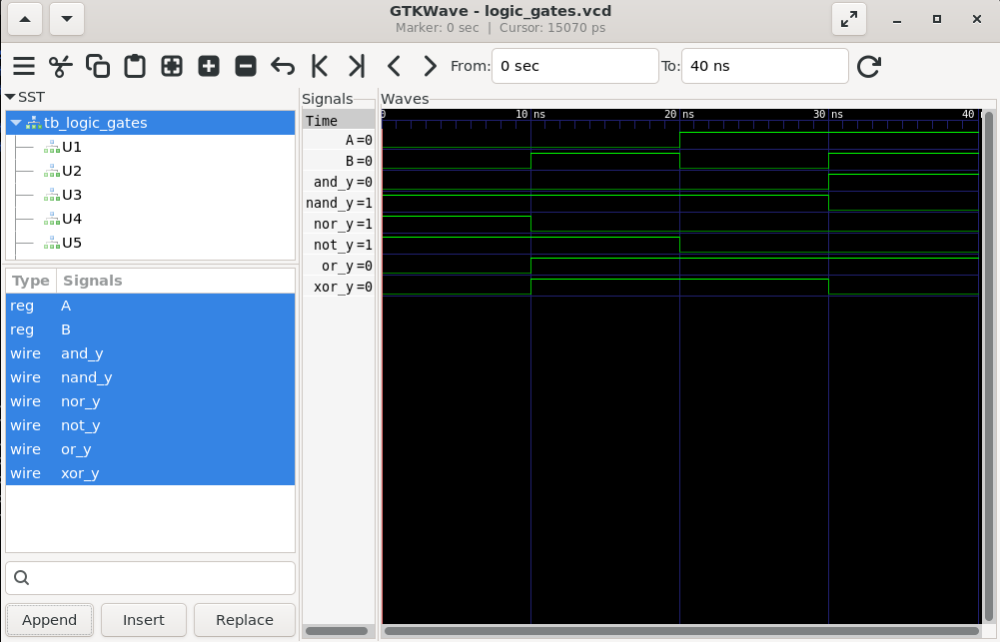
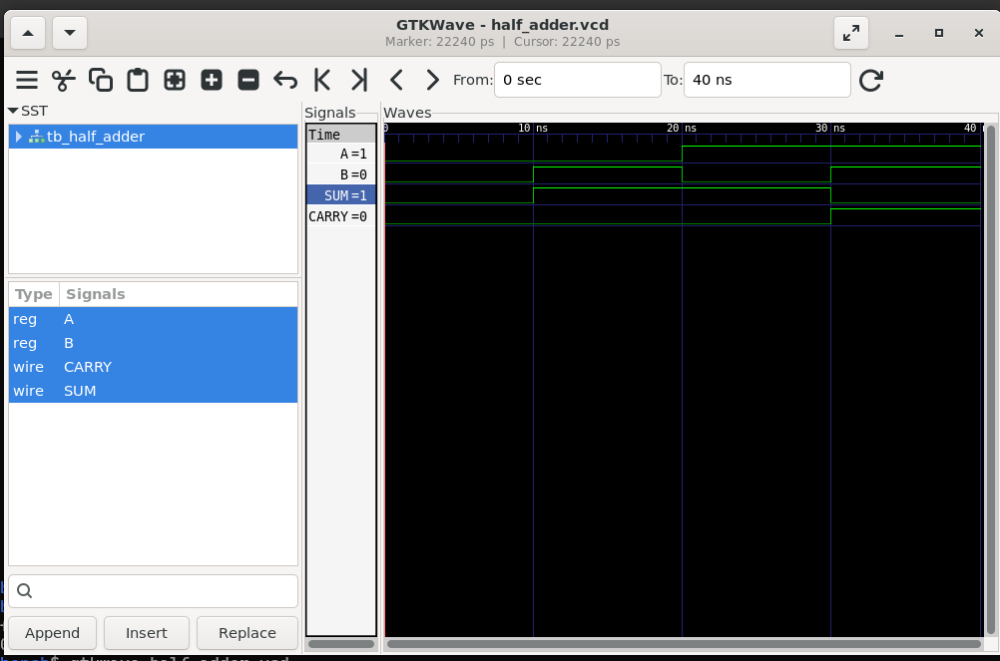
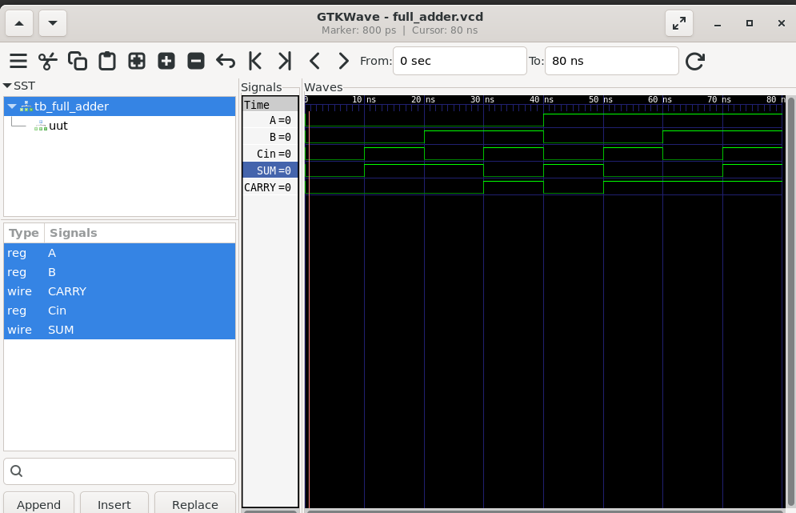

# Task 2 - Verilog Combinational Circuit Design

## Task Highlights

✔ Verilog HDL Implementation

✔ Logic Gates Design and Verification

✔ Half Adder Design and Verification

✔ Full Adder Design and Verification

✔ Icarus Verilog Simulation

✔ GTKWave Waveform Analysis

---

## Overview

Verilog HDL (Hardware Description Language) is widely used for modeling, simulation, and verification of digital circuits. This project focuses on the implementation and simulation of basic combinational circuits using Verilog HDL.

The implemented circuits include basic logic gates, Half Adder, and Full Adder. Functional verification was performed using testbenches, and the outputs were analyzed using GTKWave waveforms to validate circuit functionality.

This repository contains the implementation and simulation of fundamental digital logic gates and basic combinational circuits as part of the VLSI Design Internship at Maincrafts Technology.

---

## Documentation

📄 **Project Report**

[Verilog Combinational Circuits Report](report/Verilog_Combinational_Circuits_Report.pdf)

---

## Objectives

* Understand Verilog HDL syntax and modeling.
* Implement basic logic gates using Verilog.
* Develop testbenches for functional verification.
* Simulate circuits using Icarus Verilog.
* Analyze waveforms using GTKWave.
* Implement and verify Half Adder and Full Adder circuits.

---

## Tools Used

* Verilog HDL
* Icarus Verilog
* GTKWave
* Ubuntu (WSL)

---

## Implemented Circuits

### Basic Logic Gates

* AND Gate
* OR Gate
* NOT Gate
* NAND Gate
* NOR Gate
* XOR Gate

### Combinational Circuits

* Half Adder
* Full Adder

---

# Logic Gates

The following Verilog module implements the basic logic gates: AND, OR, NOT, NAND, NOR, and XOR.

### Waveform Verification

### Observation

The waveform outputs matched the expected Boolean operations for all implemented logic gates, confirming the correctness of the design.

---

# Half Adder

A Half Adder is a combinational circuit used to add two single-bit binary numbers.

### Equations

`SUM = A ^ B`

`CARRY = A & B`

### Waveform Verification

### Observation

The Half Adder correctly generated SUM and CARRY outputs for all possible input combinations.

---

# Full Adder

A Full Adder is a combinational circuit used to add three binary inputs: A, B, and Cin.

### Equations

`SUM = A ^ B ^ Cin`

`CARRY = (A & B) | (B & Cin) | (A & Cin)`

### Waveform Verification

### Observation

The Full Adder correctly generated SUM and CARRY outputs for all eight possible input combinations.

---

## Results

All circuits were successfully implemented using Verilog HDL and verified through simulation using Icarus Verilog and GTKWave. The generated waveforms matched the expected truth table outputs and Boolean expressions.

---

## Future Scope

* Multiplexer Design
* Demultiplexer Design
* Encoder Design
* Decoder Design
* Ripple Carry Adder
* Carry Look-Ahead Adder
* Arithmetic Logic Unit (ALU)
* FPGA Implementation

---

## Author

**Likhith Gowda H R**

Electronics and Communication Engineering

Dayananda Sagar Academy of Technology and Management (DSATM)

VLSI Design Internship - Maincrafts Technology

