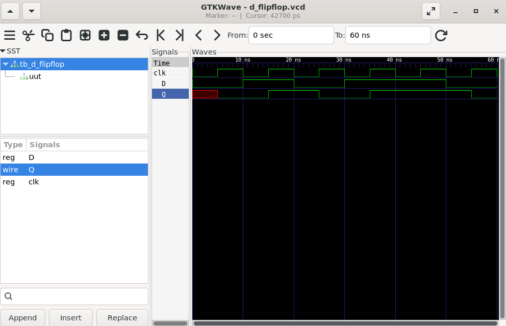
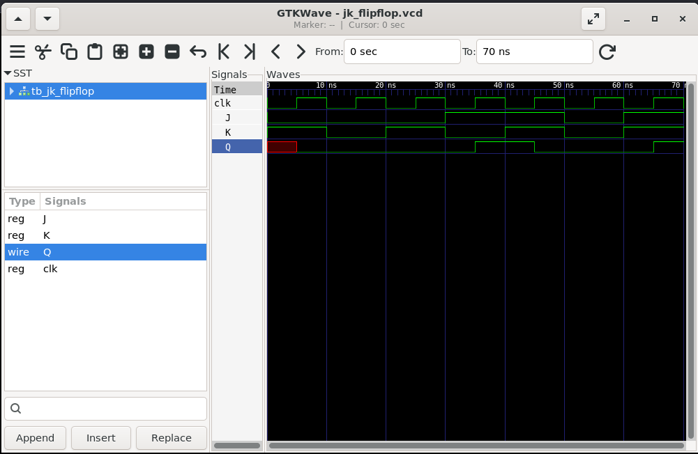
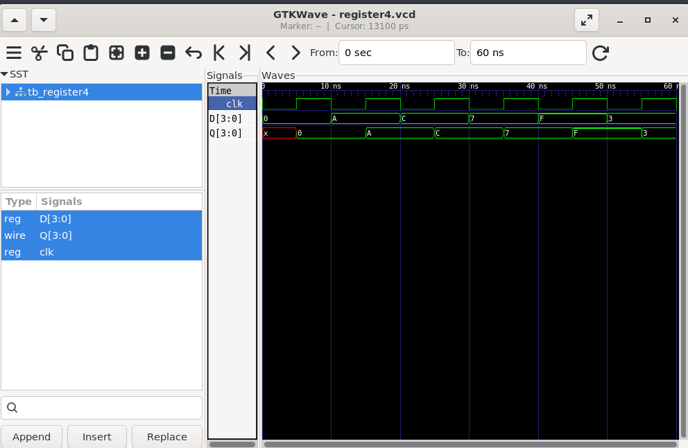
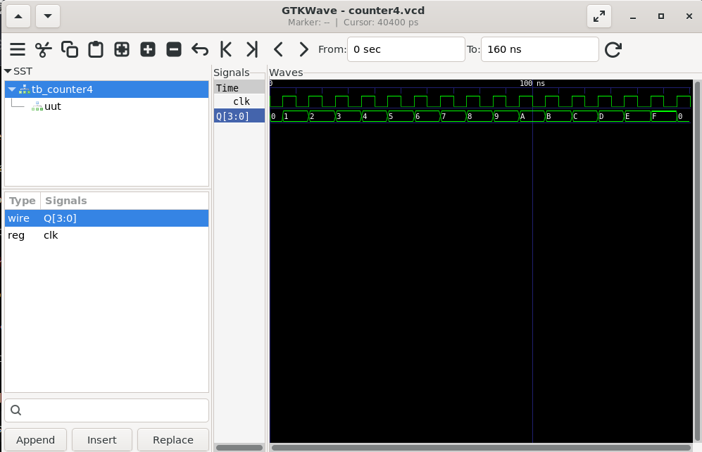

# Task 3 - Verilog Sequential Circuit Design

## Highlights

✔ Verilog HDL Implementation

✔ D Flip-Flop Design and Verification

✔ JK Flip-Flop Design and Verification

✔ 4-bit Register Design and Verification

✔ 4-bit Binary Counter Design and Verification

✔ Icarus Verilog Simulation

✔ GTKWave Waveform Analysis

---

# Overview

Verilog HDL (Hardware Description Language) is widely used for modeling, simulation, and verification of digital circuits. This project focuses on the implementation and simulation of fundamental sequential circuits using Verilog HDL.

The implemented circuits include D Flip-Flop, JK Flip-Flop, 4-bit Register, and 4-bit Binary Counter. Functional verification was performed using dedicated testbenches, and the outputs were analyzed using GTKWave waveforms to validate the correctness of each design.

This repository contains the implementation and simulation of fundamental sequential circuits as part of the VLSI Design Internship at Maincrafts Technology.

---

# Documentation

📄 Project Report

[Verilog Sequential Circuits Report](report/Verilog_Sequential_Circuits_Report.pdf)

---

# Objectives

- Understand Verilog HDL syntax and modeling.
- Implement D Flip-Flop using Verilog.
- Implement JK Flip-Flop using Verilog.
- Design a 4-bit Register.
- Design a 4-bit Binary Counter.
- Develop testbenches for functional verification.
- Simulate circuits using Icarus Verilog.
- Analyze waveforms using GTKWave.

---

# Tools Used

- Verilog HDL
- Icarus Verilog
- GTKWave
- Ubuntu (WSL)

---

# Implemented Circuits

## Flip-Flops

- D Flip-Flop
- JK Flip-Flop

## Sequential Circuits

- 4-bit Register
- 4-bit Binary Counter

---

# D Flip-Flop

The D Flip-Flop is a positive-edge-triggered sequential circuit that stores one bit of information. The output follows the input only on the rising edge of the clock signal.

## Waveform Verification

### Observation

The D Flip-Flop successfully captured the input data on every positive edge of the clock. The waveform verified correct sequential data storage.

---

# JK Flip-Flop

The JK Flip-Flop is a clock-triggered sequential circuit that performs Hold, Reset, Set, and Toggle operations depending on the J and K input combinations.

## Waveform Verification

### Observation

The JK Flip-Flop correctly performed Hold, Reset, Set, and Toggle operations for all possible input combinations.

---

# 4-bit Register

A 4-bit Register is a sequential circuit used to store four bits of binary information. The register updates its output on every positive edge of the clock signal.

## Waveform Verification

### Observation

The 4-bit Register correctly stored and transferred the input data on each positive edge of the clock. The waveform verified proper sequential storage of 4-bit binary data.

---

# 4-bit Binary Counter

A 4-bit Binary Counter is a sequential circuit that increments its output by one on every positive edge of the clock signal. After reaching the maximum count (1111), the counter rolls over to 0000 and repeats the counting sequence.

## Waveform Verification

### Observation

The 4-bit Binary Counter successfully counted from 0000 to 1111 and automatically rolled over to 0000. The waveform confirmed correct binary counting operation.

---

# Results

All sequential circuits were successfully implemented using Verilog HDL and verified through simulation using Icarus Verilog and GTKWave. The generated waveforms matched the expected sequential circuit behavior, confirming the correctness of the implemented designs.

---

# Future Scope

- Shift Register Design
- Universal Shift Register
- Ring Counter
- Johnson Counter
- Finite State Machine (FSM)
- Sequence Detector
- Traffic Light Controller
- FPGA Implementation

---

# Author

**Likhith Gowda H R**

Electronics and Communication Engineering

Dayananda Sagar Academy of Technology and Management (DSATM)

VLSI Design Internship - Maincrafts Technology
