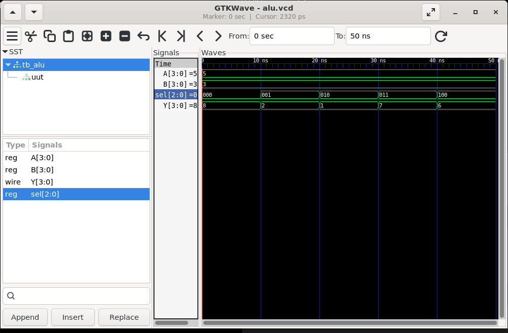
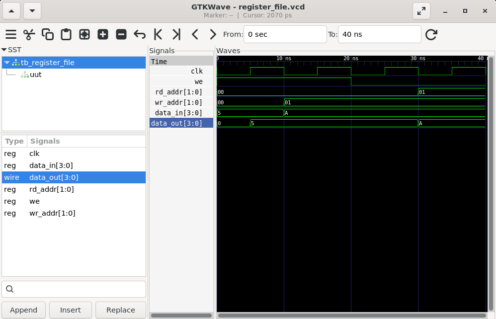
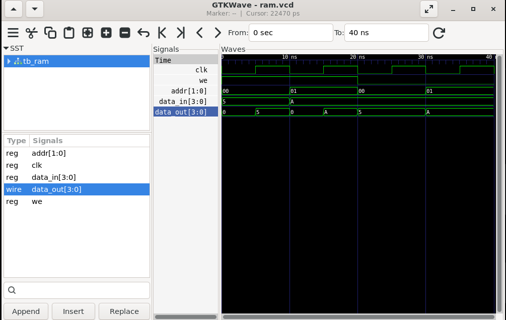
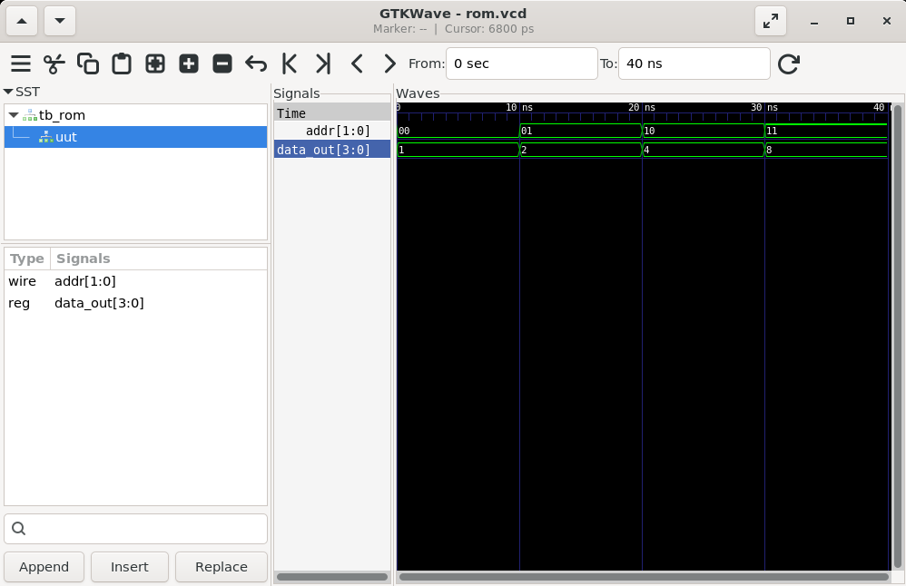
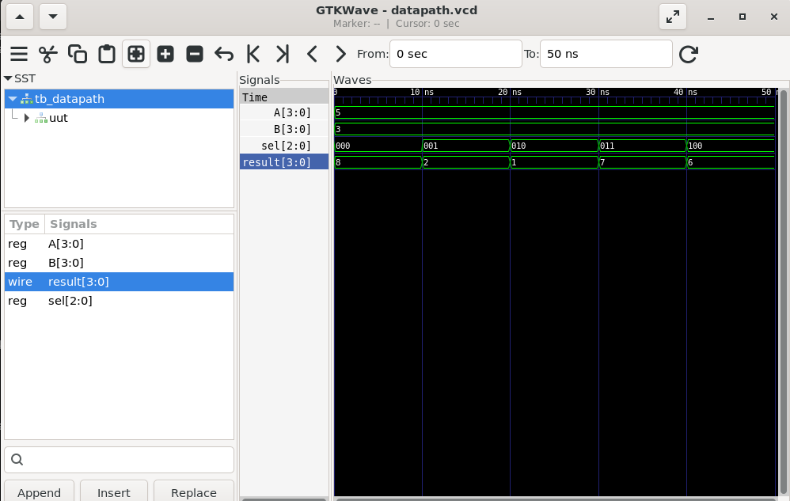

# Task 5 - RTL Design of Datapath, ALU, and Memory Components

## Highlights

✔ Verilog HDL Implementation

✔ Arithmetic Logic Unit (ALU) Design and Verification

✔ Register File Design and Verification

✔ Random Access Memory (RAM) Design and Verification

✔ Read-Only Memory (ROM) Design and Verification

✔ Datapath Integration and Verification

✔ Icarus Verilog Simulation

✔ GTKWave Waveform Analysis

---

## Overview

Verilog HDL (Hardware Description Language) is widely used for modeling, simulation, and verification of digital systems. This project focuses on the implementation and simulation of fundamental datapath and memory components using Verilog HDL.

The implemented designs include a 4-bit Arithmetic Logic Unit (ALU), Register File, Random Access Memory (RAM), Read-Only Memory (ROM), and a simple Datapath. Functional verification was performed using dedicated testbenches, and the outputs were analyzed using GTKWave waveforms to validate the correctness of each design.

This repository contains the implementation and simulation of datapath and memory components as part of the **VLSI Design Internship at Maincrafts Technology**.

---

## Documentation

📄 **Project Report**

**Verilog HDL Implementation of Datapath, ALU, and Memory Components Report**

---

## Objectives

- Understand datapath component design using Verilog HDL.
- Implement a 4-bit Arithmetic Logic Unit (ALU).
- Design a Register File with read and write operations.
- Implement Random Access Memory (RAM).
- Implement Read-Only Memory (ROM).
- Integrate the ALU into a simple Datapath.
- Develop testbenches for functional verification.
- Simulate circuits using Icarus Verilog.
- Analyze waveforms using GTKWave.

---

## Tools Used

- Verilog HDL
- Icarus Verilog
- GTKWave
- Ubuntu (WSL)

---

## Implemented Designs

### Datapath Components

- Arithmetic Logic Unit (ALU)
- Register File

### Memory Components

- Random Access Memory (RAM)
- Read-Only Memory (ROM)

### Datapath Integration

- Simple Datapath using ALU

---

# Arithmetic Logic Unit (ALU)

The Arithmetic Logic Unit (ALU) performs arithmetic and logical operations based on the select signal. The implemented operations include Addition, Subtraction, AND, OR, and XOR.

## Waveform Verification

### ALU Waveform

### Observation

The ALU successfully performed arithmetic and logical operations according to the selected control signal. The waveform verified the correct functionality of addition, subtraction, AND, OR, and XOR operations.

---

# Register File

The Register File is used for temporary data storage and supports synchronous write operations and asynchronous read operations using dedicated write and read addresses.

## Waveform Verification

### Register File Waveform

### Observation

The Register File successfully performed write and read operations. The waveform verified that data was correctly written into the selected register and accurately read from the specified register.

---

# Random Access Memory (RAM)

Random Access Memory (RAM) provides temporary data storage with read and write capabilities. Data is written on the positive edge of the clock when the write enable signal is active.

## Waveform Verification

### RAM Waveform

### Observation

The RAM successfully performed read and write operations. The waveform verified that data was correctly stored in memory and retrieved from the selected address.

---

# Read-Only Memory (ROM)

The Read-Only Memory (ROM) stores predefined data values that can be accessed using the address input. The stored contents remain fixed throughout the simulation.

## Waveform Verification

### ROM Waveform

### Observation

The ROM successfully produced the predefined output values corresponding to each address. The waveform verified correct ROM functionality.

---

# Datapath Integration

The Datapath integrates the Arithmetic Logic Unit (ALU) with input operands and demonstrates the basic flow of data through a digital processing system.

## Waveform Verification

### Datapath Waveform

### Observation

The Datapath successfully transferred the input operands to the ALU and produced the expected arithmetic and logical outputs. The waveform verified the correct integration and operation of the datapath.

---

## Results

All datapath and memory components were successfully implemented using Verilog HDL and verified through simulation using Icarus Verilog and GTKWave. The generated waveforms matched the expected behavior, confirming the correctness of the implemented ALU, Register File, RAM, ROM, and Datapath.

---

## Future Scope

- 8-bit ALU Design
- 16-bit ALU Design
- Multi-Port Register File
- Dual-Port RAM
- Processor Datapath Design
- FSM Controlled Datapath
- FPGA Implementation
- ASIC Implementation

---

## Author

**Likhith Gowda H R**

Electronics and Communication Engineering

Dayananda Sagar Academy of Technology and Management (DSATM)

**VLSI Design Internship – Maincrafts Technology**
